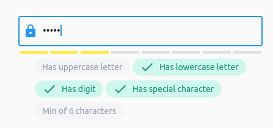
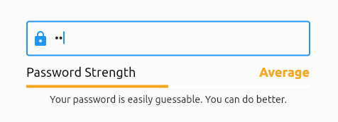

[](https://codecov.io/gh/rodrigobastosv/fancy_password_field)

#  Introduction

FancyPasswordField is a widget that acts as a password validation field. You can have all the features of a commom password field, and also gets cool features like setting validation rules and password strength.

# Basic Usage

The most simple usage is just using FancyPasswordField withou any properties.

```dart
class MyApp extends StatelessWidget {
  @override
  Widget build(BuildContext context) {
    return MaterialApp(
      title: 'Flutter Demo',
      home: Scaffold(
        body: FancyPasswordField(),
      ),
    );
  }
}
```

This will create a password field with some default configurations. The default behavior is to show the strength indicator
above the form field. You can disabled this behavior passing false to the `hasStrengthIndicator` property.


We can go a bit further and pass some validations rules to our widget.

```dart
class MyApp extends StatelessWidget {
  @override
  Widget build(BuildContext context) {
    return MaterialApp(
      title: 'Flutter Demo',
      home: Scaffold(
        body: FancyPasswordField(
            validationRules: {
                DigitValidationRule(),
                UppercaseValidationRule(),
                LowercaseValidationRule(),
                SpecialCharacterValidationRule(),
                MinCharactersValidationRule(6),
                MaxCharactersValidationRule(12),
            },
        ),
      ),
    );
  }
}
```


These package comes if some pre defined commom rules so you can just use out of the box. Feel free to implement your own [ValidationRule] and adds normaly to the password field.

# Custom Rules
As described earlier, the package comes with built in commom used rules, but you can create your own custom rules. To do this, just extends the base [ValidationRule] abstract class. You'll have to provide a name and a validation function for your rule.

```dart
class ContainsTripleAValidationRule extends ValidationRule {
  @override
  String get name => 'Contains AAA';

  @override
  bool validate(String value) {
    return value.contains('AAA');
  }
}
```

Just doing that is already enough for your rule just work. Pass your rule to the [validationRules] set of the [FancyPasswordField] and the showing and validation of the rules will occur. 

# Password Controller
The [FancyPasswordField] has a controller that you can pass. The purpose of this controller is almost the same as any controller on the Flutter world. The controller gives you access to underline info of the field. Notably, it gives you information about the rules and what rules are beeing ofended at any point. The controller has also one getter that indicates whether all rules are ok or not.

One use case of this is if you want to validate the status of the form field to enable or disable the saving of a form.

```dart
final FancyPasswordController _passwordController = FancyPasswordController();

@override
Widget build(BuildContext context) {
  return Scaffold(
    body: Center(
      child: Form(
        key: _formKey,
        child: Column(
          mainAxisAlignment: MainAxisAlignment.center,
          children: <Widget>[
            SizedBox(
              width: 400,
              child: FancyPasswordField(
                passwordController: _passwordController,
                validationRules: {
                  DigitValidationRule(),
                  UppercaseValidationRule(),
                },
                validator: (value) {
                  return _passwordController.areAllRulesValidated
                      ? null
                      : 'Not Validated';
                },
              ),
            ),
          ],
        ),
      ),
    ),
  );
}
```

# Customization
The [FancyPasswordField] comes with some pre defined widget that show some okish good looking components for the strenght indicator
and for the rules. But the widget was designed to be fully customizable. So you can pass your own builers to both the
strength password widget and the rules widget. 

On the [Samples](#samples) section you can grab a lot of customizations samples.

Above we can see an example of some possible customization for these fields.

```dart
class MyApp extends StatelessWidget {
  @override
  Widget build(BuildContext context) {
    return MaterialApp(
      title: 'Flutter Demo',
      home: Scaffold(
        body: SizedBox(
            width: 400,
            child: FancyPasswordField(
                validationRules: {
                    DigitValidationRule(),
                    UppercaseValidationRule(),
                    LowercaseValidationRule(),
                    SpecialCharacterValidationRule(),
                    MinCharactersValidationRule(6),
                    MaxCharactersValidationRule(12),
                },
                strengthIndicatorBuilder: (strength) => Text(
                  strength.toString(),
                ),
                validationRuleBuilder: (rules, value) {
                  if (value.isEmpty) {
                    return const SizedBox.shrink();
                  }
                  return ListView(
                    shrinkWrap: true,
                    children: rules
                        .map(
                          (rule) => rule.validate(value)
                              ? Row(
                                  children: [
                                    const Icon(
                                        Icons.check,
                                        color: Colors.green,
                                    ),
                                    const SizedBox(width: 12),
                                    Text(
                                        rule.name,
                                        style: const TextStyle(
                                            color: Colors.green,
                                        ),
                                    ),
                                  ],
                                )
                              : Row(
                                  children: [
                                    const Icon(
                                        Icons.close,
                                        color: Colors.red,
                                    ),
                                    const SizedBox(width: 12),
                                    Text(
                                        rule.name,
                                        style: const TextStyle(
                                            color: Colors.red,
                                        ),
                                    ),
                                  ],
                                ),
                        )
                        .toList(),
                  );
                },
              ),
            ),
      ),
    );
  }
}
```


## Samples




## Suggestions & Bugs

For any suggestions or bug report please head to [issue tracker][tracker].

[tracker]: https://github.com/rodrigobastosv/fancy_password_field/issues